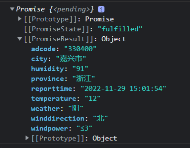
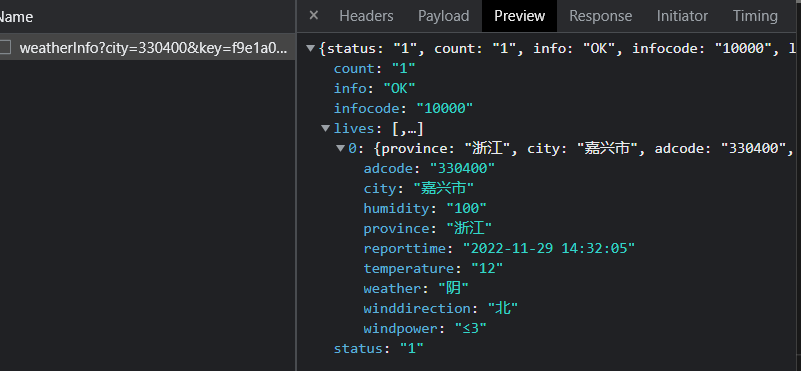

# 天气

```javascript
getWeather()
```

入参：

@param{String}cityCode 城市编码，默认**330400**

@param{String}key 高德api调用key，默认**442b97f4e1c843da3a75a18528868070**

@param{String}extensions='base' 气象类型  **base**:返回实况天气(默认) all:返回预报天气

出参：{Object} 天气数据

humidity：湿度；temperature：温度；winddirection：风向；windpower：风力



接口返回数据


